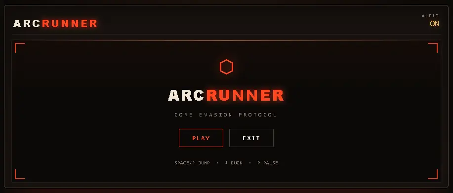

<div align="center">
    
    <h1 align="center">
        Arc Runner
    </h1>
    <b>The offline dinosaur game drank five energy drinks, had a cyberpunk awakening, and morphed into an ember-powered combat mech runner.</b>
    </br>
    </br>
    <p align="center">
        <a href="https://bun.sh">
            
        </a>
        <a href="https://www.typescriptlang.org/">
            
        </a>
        <a href="./LICENSE">
            
        </a>
    </p>

</div>

Your internet drops. Chrome hands you a cute little cactus-hopping dinosaur. But what if that dinosaur was an autonomous ember-core mech dodging burning ground servers and aerial laser drones at 60 FPS while your CPU synthesizes 8-bit sound effects out of thin air? That is Arc Runner in 100 seconds.

## ✨ Features

- **Zero Asset Bloat**: Not a single MP3 or WAV file was downloaded. Every boot beep, jump sweep, duck slide, and explosive crash is synthesized live in your browser using the Web Audio API with raw sine, square, and triangle oscillators.
- **Hardware-Accelerated 2D Canvas**: Locked at a crisp 60 FPS with zero virtual DOM overhead getting between your spacebar and your mech's jump timing.
- **Retro Cyberpunk HUD**: Glowing scanlines, boot diagnostics, corner HUD brackets, particle systems, and screen shake for when you inevitably faceplant into a server stack.
- **Dynamic Difficulty**: Procedural obstacle generation with speed acceleration scaling from a calm `6 px/frame` all the way up to a chaotic `16 px/frame`.
- **Dynamic Hitbox Shifting**: Ducking drops your player collision envelope from `50 px` down to `26 px` tall so you can slide clean under low-flying surveillance drones.
- **Zero-Dependency Build Pipeline**: Bundles in milliseconds with Bun. No hundred-megabyte dependency black hole eating your disk space.

## 🚀 Usage

1. Clone the repository:
    ```bash
    git clone https://github.com/mr-nilarnab/arc-runner.git
    ```
    ```bash
    cd arc-runner
    ```
2. Start the development server:
    ```bash
    bun run dev
    ```
3. Open `http://localhost:3000` in your browser.
4. Press `SPACE` to initiate boot diagnostics and start your run.

**Production Build:** `bun run build`

## 🕹️ Controls

| Action             | Keyboard                  | Touch / Mobile           |
| :----------------- | :------------------------ | :----------------------- |
| **Jump**           | `SPACE` or `↑` (Arrow Up) | Tap screen or tap ▲ JUMP |
| **Duck**           | `↓` (Arrow Down)          | Hold ▼ DUCK              |
| **Pause / Resume** | `P`                       | Tap screen or press `P`  |
| **Main Menu**      | `ESC`                     | Tap MAIN MENU            |
| **Quick Restart**  | `R`                       | Tap RELAUNCH             |
| **Toggle Audio**   | Click `AUDIO` in HUD      | Tap `AUDIO` in HUD       |

## ⚙️ Physics Specs

For the nerds who like hard numbers:

- **Gravity**: `0.62 px/frame`
- **Jump Impulse**: `-11.4 px/frame`
- **Standing Hitbox**: `42 × 50 px`
- **Ducking Hitbox**: `58 × 26 px`
- **Base Speed**: `6 px/frame` (ramps smoothly up to `16 px/frame`)
- **Milestone Chime**: Plays every `500` meters

## 🔧 Customization

Want to tweak the game balance? All core parameters live in plain TypeScript constants:

- **Physics & Speed**: Edit `src/ts/core/constants/game.constants.ts` to modify `GRAVITY`, `JUMP_FORCE`, or `MAX_SPEED`.
- **CRT & HUD Theme**: Tweak `:root` custom properties in `src/css/tokens/tokens.css` to switch colors to matrix green, cyan, or neon magenta.
- **Boot Sequence**: Customize the terminal diagnostic lines in `BOOT_LINES` inside `src/ts/core/constants/game.constants.ts`.

## 📄 License

This project is licensed under the [MIT License](./LICENSE). Fork it, tweak the physics, beat the high score, and build something cool.

---

<div align="center">
    <sub>Enjoying Arc Runner? A 🌟 on GitHub goes a long way.</sub>
</div>
